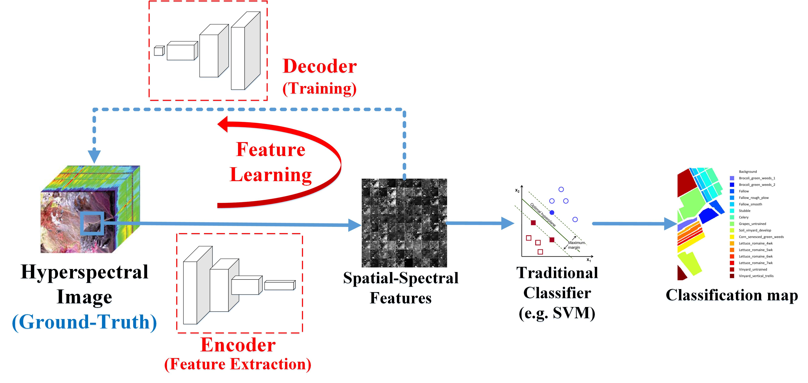

## Unsupervised Spatial-Spectral Feature Learning by 3-Dimensional Convolutional Autoencoder for Hyperspectral Classification

By [Shaohui Mei](http://teacher.nwpu.edu.cn/en/meishaohui.html), [Jingyu Ji](https://github.com/JiJingYu), [Yunhao Geng](https://github.com/lawsX), Zhi Zhang,  [Xu Li](http://teacher.nwpu.edu.cn/en/lixu.html), [Qian Du](http://my.ece.msstate.edu/faculty/du/).

<p align="center">
<br /><a> Proposed Framework</a>
</p>

---
## Introduction

Feature learning technologies using deep neural networks (DNN) have shown superior performance over traditional hand-crafted feature extraction algorithms. However, a large amount of training samples are generally required for DNN to learn effective features, which is difficult to be obtained in hyperspectral images. Therefore, in this paper, an unsupervised spatial-spectral feature learning strategy is proposed for hyperpectral images using 3-Dimensional Convolutional AutoEncoder (3D-CAE). The proposed 3D-CAE consists of 3D or elementwise operations only, such as 3D convolution, 3D pooling, and 3D batch normalization, to maximally explore spatial-spectral structure information for feature extraction. A companion 3D convolutional Decoder network is also designed for reconstruction the input patterns, by which all the parameters involved in the network can be trained without labeled training samples. Ex- perimental results on several benchmark hyperspectral datasets have demonstrated that our proposed 3D-CAE are very effective in extracting spatial-spectral features and outperform not only traditional unsupervised feature extraction algorithms, but also many supervised feature extraction algorithms in classification application.

---

## Citing our work

Please cite our work in your publications if it helps your research:

```latex
later it will be released.
```

---

## Installation

1. Please follow [keras instruction](https://keras.io/) to install all necessary packages and build it.

```bash
pip install keras
```

     - Note: We currently only support Python 3.

2. train in indian pines dataset.

```python
python3 train_indian_pines.py
```

---

## Preprocess

In our paper, amount of spatial information about hyperspectral image was explored. In our code, 5x5 spatial size was used to compare.

run script as follow :

```python
python3 ./preprocess/pre_process_by_yield.py
```

Then you can find the file named `"./hyperspectral_datas/indian_pines/data/indian_5d_patch_5.h5".`

---

## Traineval

- To train or evaluate CNN using the train script simply specify the parameters listed in `train.py` as a flag or manually change them.

```Shell
python train.py
```

- Training Parameter Options:

```python
parser = argparse.ArgumentParser(description="train 3DCAE net",
                                formatter_class=argparse.ArgumentDefaultsHelpFormatter)
parser.add_argument('--mode', type=str, default='train',
                    help='train, test, finetune, test_finetune ')
parser.add_argument('--epoch', type=int, default=200,
                    help='1000 is ok')
args = parser.parse_args()
```
